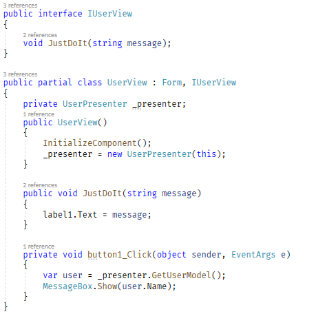
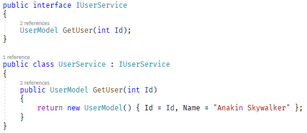
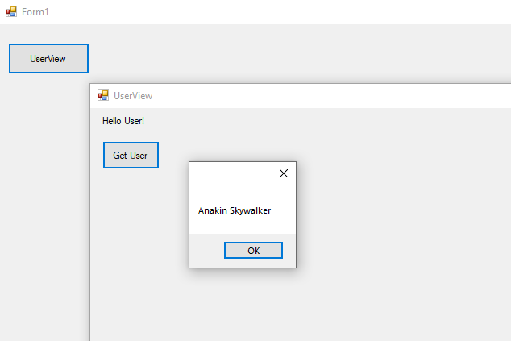

# WinForms Dependency Injection Sample
 A quick demonstration for using Dependency Injection in .NET Framework 4.7 WinForms Application with MVP Pattern.
 
## Dependencies
|Package Name|Version|
|---|---|
|[Microsoft.Extensions.DependencyInjection](https://www.nuget.org/packages/Microsoft.Extensions.DependencyInjection/)|5.0.1|

---

## Screenshots

### Program.cs
You should register your services in **ConfigureServices()** method. The **Service Provider** property should be in Program.cs too. Method named **GetService<T>** is just added for handling your service object easier.

---

### Presenter Layer
As I mentioned before, we are going to use **GetService<T>** method from _Program.cs_ to call our service objects here.

---

### View Layer
Now we are calling method from presenter like we do.

---

### Sample Service 

---

### Output
In this sample, executing UI method from **UserView** which calls from **UserPresenter** that references **IUserService** which is the origin reference of method implemented in **UserService**.

